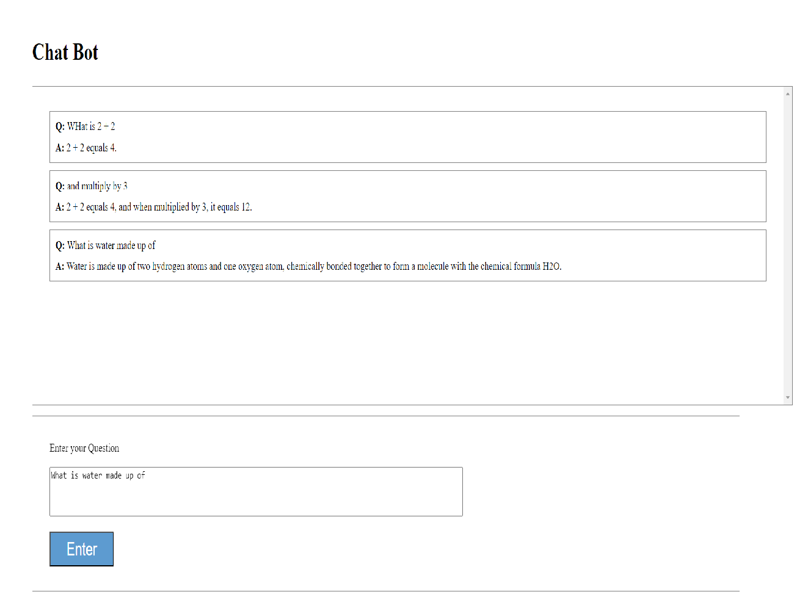

# Simple Python Server with LangChain

This is a simple Chat bot app replica that uses:

- Tornado as a Python server
- LangChain and OpenAI for chat capabilities
- Html, JS and CSS for UI

## Local Development

\***\* Assuming you have python installed locally. \*\***

- First make sure you add your Open AI API key in the .env.example and rename the file to ".env".
- Run `pip install` to install the dependencies.
- To run the server run `python server.py`.

